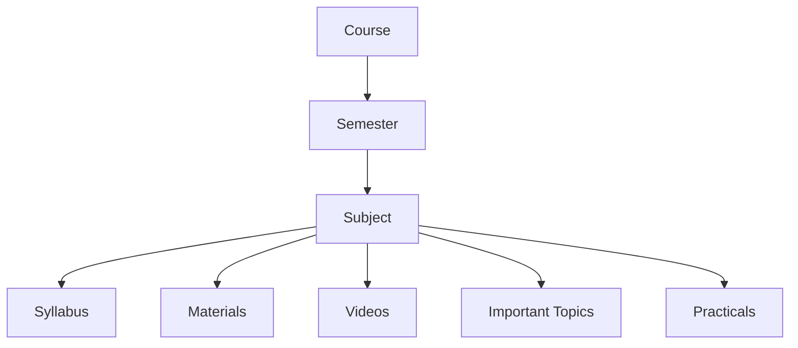

# System Design


```mermaid
graph TD
    Course[Course] --> Semester[Semester]
    Semester --> Subject[Subject]
    Subject --> Syllabus[Syllabus]
    Subject --> Materials[Materials]
    Subject --> Videos[Videos]
    Subject --> ImportantTopics[Important Topics]
    Subject --> Practicals[Practicals]
```

## Hierarchy Diagram
```text
Course
  ↓
Semester
  ↓
Subject
  ├── Syllabus
  ├── Materials
  ├── Videos
  ├── Important Topics
  └── Practicals
```
